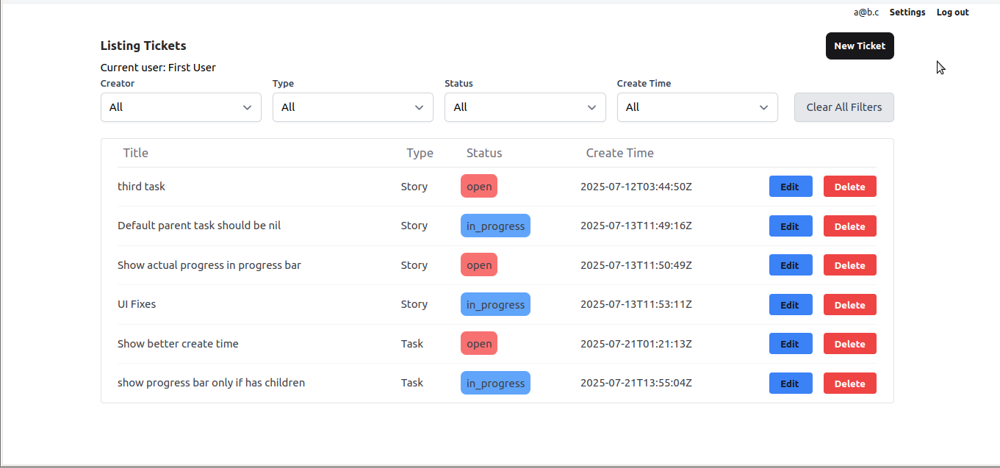
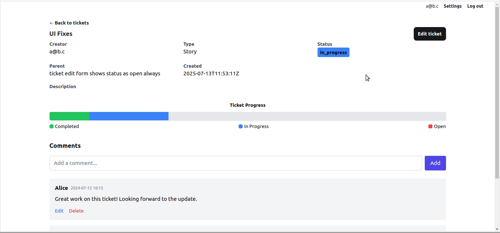

<div align="center">
  
  <p><strong>An opinionated project management system for small orgs</strong></p>
  <p><em>Status: v0.5.3. Under active development. Version 1.0 expected in 3 months.</em></p>
</div>

---

## Table of Contents

- [Why Cumin?](#why-cumin)
- [Getting Started](#getting-started)
- [How to Run](#how-to-run)
- [Features](#features)
- [Technology Stack](#technology-stack)
- [Roadmap](#roadmap)
- [Contributing](#contributing)
- [License](#license)
- [A Note on the Name](#a-note-on-the-name)
- [Screenshots](#screenshots)

---

## Why Cumin?

Cumin is intentionally simple project management tool. It's built for small organizations and solo developers who need structure without the overwhelming flexibility and cost of larger systems.

Cumin is **opinionated** to help you get started immediately:
-   **Fixed Hierarchy:** It enforces a clear `Project → Epic → Story → Task` workflow, removing the guesswork from organizing your work.
-   **Simple Access Control:** There is one level of control: the Admin user. No complex roles or permissions to manage, making it perfect for small, trusted teams.
-   **Focus on the Essentials:** Cumin provides the core features you need to manage tickets without the clutter of features you don't.

---

## Getting Started

To get your Cumin instance up and running quickly:

1.  **Get Docker Compose:**
    *   **Clone the entire Repo:** `git clone https://github.com/kulkarniniraj/phx_tickets.git && cd phx_tickets`
    *   **Or download `docker-compose.yml`:** Get `docker-compose.yml` from this repo and save it in your desired directory.
2.  **Start the Application:** From the directory containing `docker-compose.yml`, run `docker-compose up -d`.
3.  **Access the App:** Open your web browser and navigate to `http://localhost:4000`.
4.  **Automatic Admin & Login:**
    *   An initial administrator account is automatically created upon first start with migrations.
    *   **Email:** `admin@example.com`
    *   **Password:** `password123`
    *   Use these credentials to log in. You can change the admin password via user settings.
5.  **User Management:** Let other users sign up. You can then approve or reject their requests from the Admin Panel.

---

## How to Run 

### 1. Using Docker, published image (Recommended)
- **Requirements:**
  - Docker
  - Docker Compose
- **Setup:**
  - Get docker-compose.yml from this repo
    - Either clone the entire Repo
    - Or download docker-compose.yml from this repo [https://github.com/kulkarniniraj/phx_tickets/blob/main/docker-compose.yml](docker-compose.yml) and save it as `docker-compose.yml` in the same directory
  - Run `docker-compose up -d`
    
### 2. Build your own image
- **Requirements:**
  - Docker
  - Docker Compose
  - Git
  - Elixir 1.18
  - Erlang/OTP 28
  - Dependencies as specified in `mix.exs`
- **Setup:**
  - Clone the entire Repo
  - Run `mix deps.get`
  - Run `docker build -t <your-image-name> .`
  - Run `docker run -d -p 4000:4000 -v <your-project-folder>:/mnt <your-image-name>`
  - The app runs at [http://localhost:4000](http://localhost:4000)

### 3. Run from source, for development 

- **Requirements:**
  - Elixir 1.18
  - Erlang/OTP 28
  - Dependencies as specified in `mix.exs`

- **Setup:**
  1. Install dependencies:
     ```sh
     mix deps.get
     ```
  2. Start the development server:
     ```sh
     mix phx.server
     ```
  3. The app runs at [http://localhost:4000](http://localhost:4000)

- **Database:**
  - Uses SQLite
  - The database file is created in the local project folder automatically

---

## Features

Cumin offers a focused set of features designed to get you organizing your work immediately.

-   **🗂️ Structured Project Management:** Enforces a clear `Project → Epic → Story → Task` hierarchy, providing structure out-of-the-box.
-   **👤 Admin-First User Management:**
    -   Simple user registration.
    -   New sign-ups require approval from an administrator, ensuring a secure environment.
    -   Admin panel for viewing all users and managing pending approvals.
-   **🎫 Core Ticketing System:**
    -   Create, edit, and comment on tickets.
    -   Assign tickets to users.
    -   View ticket details, including history and relationships.
-   **🔎 Dynamic Filtering:**
    -   Filter the main ticket dashboard by Project.
    -   Your active project is saved to your user profile for a persistent view.
    -   Additional filters for assignee, ticket type, and status.

---

## Technology Stack

-   **Backend:** [Elixir](https://elixir-lang.org/) & [Phoenix LiveView](https://hexdocs.pm/phoenix_live_view/Phoenix.LiveView.html)
-   **Database:** SQLite
-   **Frontend:** [Tailwind CSS](https://tailwindcss.com/) & [Alpine.js](https://alpinejs.dev/)
-   **LLM Usage:** 
    - **Web based**: ChatGPT, Gemini, Claude
    - **CLI/IDE based**: Gemini free (primary), Cursor, Windsurf, Copilot
---

## Roadmap

-   **🤖 LLM Agent Integration:** Future versions will include integration with Large Language Models to allow for managing tickets through natural language prompts.

---

## Contributing

Contributions are welcome! Whether it's reporting a bug, suggesting a feature, or submitting a pull request, your help is appreciated.

1.  Fork the repository.
2.  Create your feature branch (`git checkout -b feature/AmazingFeature`).
3.  Commit your changes (`git commit -m 'Add some AmazingFeature'`).
4.  Push to the branch (`git push origin feature/AmazingFeature`).
5.  Open a Pull Request.

Please open an issue first to discuss any major changes you would like to make.

---

## License

Cumin uses a dual-licensing model:

-   **Fair Source License 10 (Cumin Variant):** This allows **free usage** for individuals and organizations with **10 or fewer employees**, including commercial use. See `LICENSE.md` for full details.
-   **Commercial License:** Organizations with **more than 10 employees** must obtain a commercial license. This model is designed to sustain the project by enabling commercial development and support for larger entities, while keeping it free and open for the majority of small teams. See `LICENSE-COMMERCIAL` in `LICENSE.md` for details on commercial terms.

This project is primarily licensed under the Fair Source License 10.


---

## A Note on the Name

The name "Cumin" is a pun on "Jira" and the Hindi word for cumin, "Jeera".

---

## Screenshots

**Ticket List**



**Ticket Show**



Logo created with [Namecheap](https://www.namecheap.com)